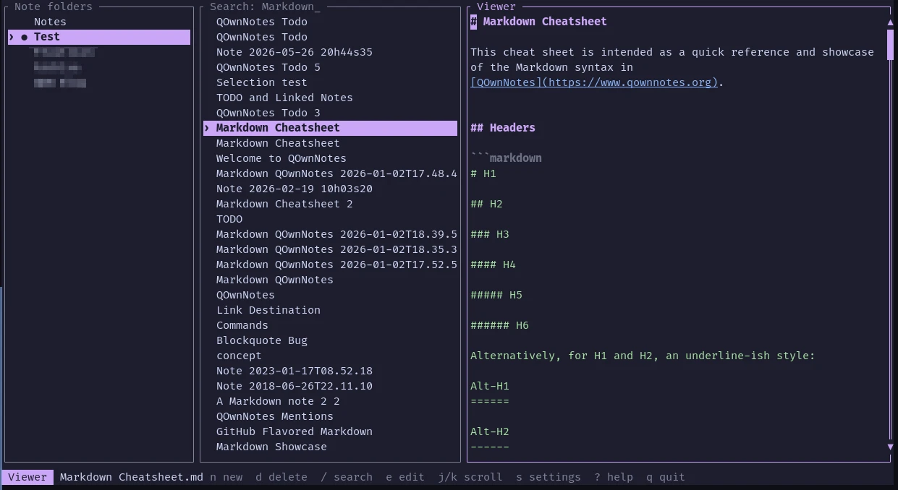

# qownnotes-tui

`qownnotes-tui` is a keyboard-first terminal browser and editor for local,
QOwnNotes-compatible Markdown note folders.
See [`CHANGELOG.md`](CHANGELOG.md) for notable changes.



## Run

Enter the development environment and open a note folder:

```console
nix develop
just run --notes-dir ~/Notes
```

Alternatively, build and run the Nix package directly:

```console
nix run . -- --notes-dir ~/Notes
```

The note root can also be set with `QOWNNOTES_TUI_NOTES_DIR` or with
`notes_dir = "/path/to/notes"` in the platform configuration file. CLI options
take precedence over the environment and configuration file. If none is set,
the application reads all available configured note folders from QOwnNotes and
initially opens its current folder. The QOwnNotes application database is
opened read-only.

## Shell Completions

The Nix package installs completions for Bash, Fish, and Zsh automatically.
Completion scripts can also be generated manually:

```console
qownnotes-tui --generate-completion bash
```

Supported values are `bash`, `elvish`, `fish`, `powershell`, and `zsh`. The
command writes the completion script to standard output.

## Keys

| Key                     | Action                                  |
| ----------------------- | --------------------------------------- |
| `j`, `k`                | Move selection or scroll the viewer     |
| `PageUp`, `PageDown`    | Scroll the viewer by one page           |
| `Home`, `End`           | Jump to the start or end of the note    |
| `h`, `l`, `Tab`         | Switch panes                            |
| `Enter`                 | Activate a note folder or open a note   |
| `n`, `Ctrl-n`           | Create a timestamped note               |
| `d`                     | Delete a note after confirmation        |
| `e`                     | Edit the selected note                  |
| `/`                     | Search note names and text              |
| `Ctrl-s`                | Save the note                           |
| `Esc`                   | Leave editor or return to the note list |
| `Ctrl-r`                | Discard edits and reload from disk      |
| `PageUp`, `PageDown`    | Move by one page while editing          |
| `Ctrl-Home`, `Ctrl-End` | Move to note start or end while editing |
| `s`                     | Open settings                           |
| `R`                     | Rescan the active note folder           |
| `?`                     | Show help                               |
| `q`, `Ctrl-c`           | Quit                                    |

Search terms are case-insensitive and all terms must match; use quotes to search
for a phrase. Press `Enter` to keep the filtered list or `Esc` to clear it. The
viewer soft-wraps and syntax-highlights Markdown. Notes automatically save
at the interval configured in Settings > General (10 seconds by default). New
notes start with a `# Note YYYY-MM-DD HHhMMsSS` heading. On save, note filenames
automatically follow the first meaningful content line; conflicting filenames
receive a numeric suffix. Clean notes reload when their files change outside
the app. Note folders and notes can also be activated with the left mouse button,
and the mouse wheel scrolls lists or the viewer. The note list follows QOwnNotes'
configured alphabetical or last-change sorting. The application detects
conflicting external edits before writing a modified note.

Deleting a note asks for confirmation and moves it to the platform trash when
available. If trashing is unavailable, the confirmed deletion permanently
removes the file.

## Theming

Colors can be overridden in `theme.toml` beside the application `config.toml`.
Values may be terminal color names such as `cyan` or six-digit RGB colors:

```toml
background = "#1e1e2e"
foreground = "#cdd6f4"
accent = "#cba6f7"
accent_foreground = "#1e1e2e"
```

Available keys are `background`, `foreground`, `muted`, `accent`,
`accent_foreground`, `success`, `warning`, `error`, `heading`, `quote`, `code`,
`link`, `fence`, and `field_background`. Unspecified keys retain their defaults.
The default theme uses the terminal's ANSI palette and reset background, so it
automatically follows terminal themes configured by Catppuccin or similar tools.
An explicit `theme.toml` is only needed to override those terminal colors.

The flake exports a Home Manager module for creating the file declaratively:

```nix
{
  imports = [ inputs.qownnotes-tui.homeModules.default ];

  programs.qownnotes-tui = {
    enable = true;
    theme = {
      background = "#1e1e2e";
      foreground = "#cdd6f4";
      accent = "#cba6f7";
      accent_foreground = "#1e1e2e";
    };
  };
}
```

The color values can also be assigned from palette attributes provided by
another Nix module.

## Development

Run `just` to list recipes. The main validation command is `just check`; use
`just nix-build` for the reproducible package and `just flake-check` to validate
all flake outputs.

Rust 1.85 is the minimum supported version. The crate uses Rust edition 2024.

## License

Copyright (C) 2026 qownnotes-tui contributors. Licensed under GPL-2.0-only. See
[`LICENSE`](LICENSE).
